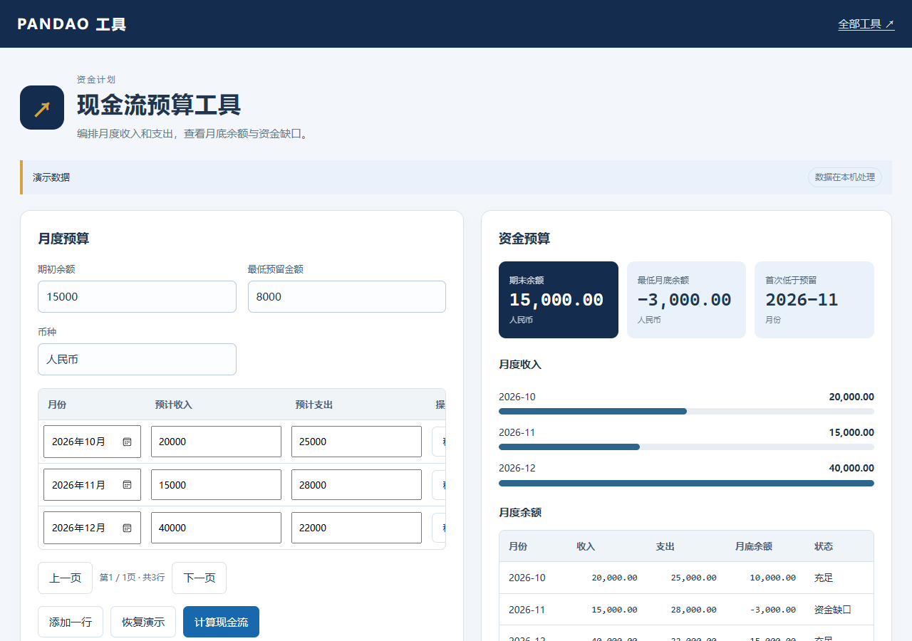

# 现金流预算工具

编排月度收入和支出，查看月底余额与资金缺口。

浏览器本机运行，无需注册，也无需配置付费接口。演示资料均为虚构示例。

[在线使用](https://tianchaodaxing-beep.github.io/pandao-cashflow/) · [下载版本](https://github.com/tianchaodaxing-beep/pandao-cashflow/releases/latest) · [全部工具](https://github.com/tianchaodaxing-beep/pandao-open-tools)

## 开始使用

从版本页面下载工具压缩包，解压后双击 `index.html`。Windows 也可以双击 `启动工具.cmd`。需要保留整个目录，不能只复制HTML文件。

1. 填写期初余额、最低预留金额和统一币种。
2. 编辑或导入月份、预计收入和预计支出，月份采用YYYY-MM。
3. 计算现金流，查看各月余额并导出预算。

## 文件与数据

表格支持 `.xlsx`、`.xls`、`.csv`、`.tsv`；只读取第一个工作表。单表最多20,000行、10 MB。文字文件的支持范围以工具说明为准。

输入资料在浏览器本机处理，不会通过本工具上传到服务器；点击外部反馈链接时会打开GitHub。导出文件由使用者保管。当前版本不自动保存输入，关闭前请导出需要的结果。

## 使用范围

预算跨度最多36个月。遗漏月份显示零收入和零支出，重复月份合并；请核对是否完整录入。结果为用户输入的预算，不代表实际到账。

## 开发与许可

使用 Node.js 20 或更新版本运行 `npm test`。运行网页无需安装Node.js或其他依赖。

本项目采用MIT许可证，允许商业使用、修改和分发，需保留许可声明。第三方表格库采用独立许可证，详见 THIRD_PARTY_NOTICES.md。

## 反馈与定制需求

请通过[项目问题区](https://github.com/tianchaodaxing-beep/pandao-cashflow/issues)描述使用场景、遇到的问题或希望增加的功能。公开反馈请使用演示资料，避免提交客户资料和账号凭据。
